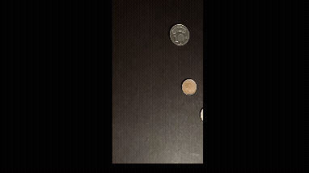
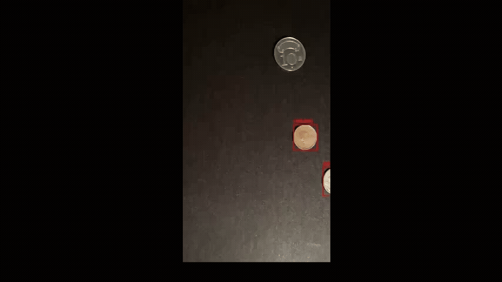

# Q1

# 硬幣偵測與影像處理

 目標是透過 **Python (OpenCV)** 與 **MATLAB** ，對影片中硬幣的即時偵測、定位與標註。

---

##  開發環境
* **語言**: Python , MATLAB 
* **開發工具**: VS Code, MATLAB Online

---

##  演算法邏輯 (Algorithm Workflow)
不論是 Python 或 MATLAB 版本，核心邏輯均遵循以下影像處理管線：

1. **影像預處理**: 將原始 RGB 幀轉為**灰階 **，並使用**高斯模糊 ** 去除環境雜訊。
2. **二值化處理 **: 
   - 設定亮度門檻（門檻值約 0.45 - 0.5 之間）將硬幣與背景分離。
   - 針對反光問題調整門檻，確保暗處硬幣也能被正確切割。
3. **連通域分析與特徵提取**:
   - 偵測閉合輪廓。
   - **面積過濾 **：設定門檻（如 > 10,000 像素）排除鍵盤按鍵或細小雜訊。
4. **即時標註**: 提取目標物的中心點  與邊界框 ，並即時繪製紅框與座標。

---

##  實作成果展示

### 1. Python 成果
```
import cv2
import numpy as np

# 1. 讀取影片
cap = cv2.VideoCapture('coin.mp4')

# 準備影片寫入器 
width = int(cap.get(cv2.CAP_PROP_FRAME_WIDTH))
height = int(cap.get(cv2.CAP_PROP_FRAME_HEIGHT))
fps = cap.get(cv2.CAP_PROP_FPS)
# 定義編碼並建立 VideoWriter 物件
fourcc = cv2.VideoWriter_fourcc(*'mp4v')
out = cv2.VideoWriter('output.mp4', fourcc, fps, (width, height))

while cap.isOpened():
    ret, frame = cap.read()
    if not ret: break

    # 2. 影像處理
    gray = cv2.cvtColor(frame, cv2.COLOR_BGR2GRAY)
    blurred = cv2.GaussianBlur(gray, (15, 15), 0)
    _, thresh = cv2.threshold(blurred, 100, 255, cv2.THRESH_BINARY)

    # 3. 找輪廓並標註
    contours, _ = cv2.findContours(thresh, cv2.RETR_EXTERNAL, cv2.CHAIN_APPROX_SIMPLE)
    for cnt in contours:
        area = cv2.contourArea(cnt)
        if 3500 < area < 50000: 
            x, y, w, h = cv2.boundingRect(cnt)
            # 畫框與文字
            cv2.rectangle(frame, (x, y), (x + w, y + h), (0, 0, 255), 2)
            cv2.putText(frame, f"({x},{y})", (x, y-10), cv2.FONT_HERSHEY_SIMPLEX, 0.5, (0,0,255), 2)

    # 4. 顯示與存檔
    cv2.imshow('Result', frame)
    out.write(frame) # 將這一幀畫面寫入影片檔案

    if cv2.waitKey(1) & 0xFF == ord('q'):
        break

# 5. 釋放資源 
cap.release()
out.release()
cv2.destroyAllWindows()
print("偵測完成！影片已存為 output.mp4")
```
* **預覽**:
### Python 偵測結果




### 2. MATLAB 實作成果
* **實作檔案**:
```
% MATLAB 硬幣偵測程式碼
% 讀取影片檔
v = VideoReader('coin.mp4');
% 在第 4 行下面加入這兩行，讓程式知道影片的原始尺寸
width = v.Width;
height = v.Height;
% 準備輸出影片檔 (output_matlab.mp4)
v_out = VideoWriter('output_matlab', 'Motion JPEG AVI');
open(v_out);

% 建立顯示視窗
  figure('Name', 'MATLAB Coin Detection');
% 強制固定視窗大小，避免手動縮放視窗導致寫入失敗
fig = figure('Name', 'MATLAB Coin Detection', 'Units', 'pixels', 'Position', [100 100 640 480]);
  set(gca, 'Units', 'normalized', 'Position', [0 0 1 1]); % 讓影像填滿視窗
while hasFrame(v)
frame = readFrame(v);
    
% --- 影像處理與標註  ---
    gray = rgb2gray(frame);
    blurred = imgaussfilt(gray, 2);
    thresh = imbinarize(blurred, 0.45)
    stats = regionprops(thresh, 'BoundingBox', 'Centroid', 'Area');
    
    for k = 1:length(stats)
        if stats(k).Area > 10000 && stats(k).Area < 100000
            bb = round(stats(k).BoundingBox);
            frame = insertShape(frame, 'Rectangle', bb, 'Color', 'red', 'LineWidth', 5);
            centroid = stats(k).Centroid;
            frame = insertText(frame, [centroid(1) centroid(2)-20], ...
                sprintf('(%.0f,%.0f)', centroid(1), centroid(2)), 'FontSize', 18, 'TextColor', 'red', 'BoxOpacity', 0);
        end
    end

    writeVideo(v_out, frame);
    end close(v_out);
    fprintf(' 偵測完成');
```

* **預覽**:
  

---

##  參數調整心得
在實作過程中，針對環境光線進行了多次參數挑整：
* **門檻值**: 從 0.7 降至 0.45，解決了硬幣亮度不足導致偵測不到的問題。
* **面積過濾**: 將下限提升至 **10,000**，過濾掉背景中亮度較高的鍵盤字母干擾。

---
